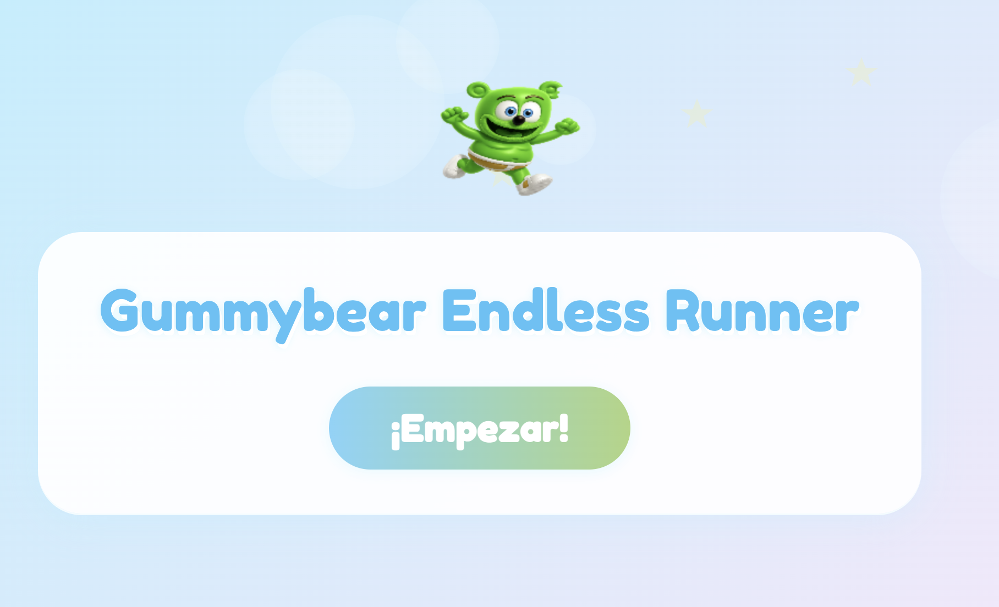
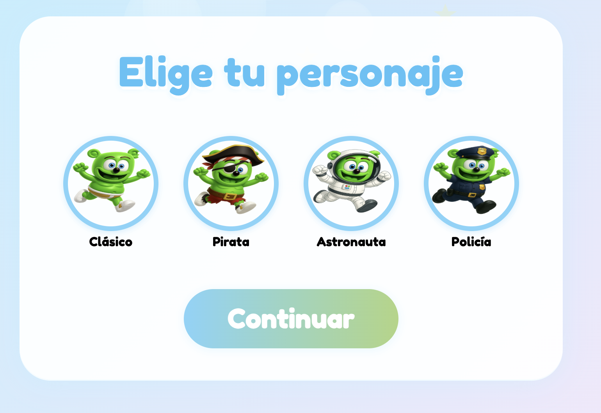
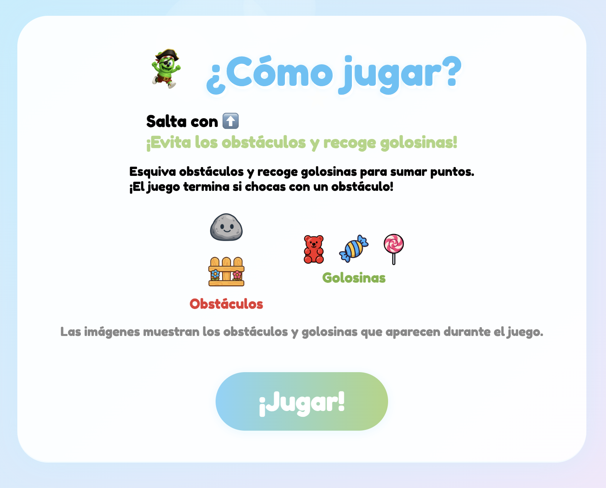
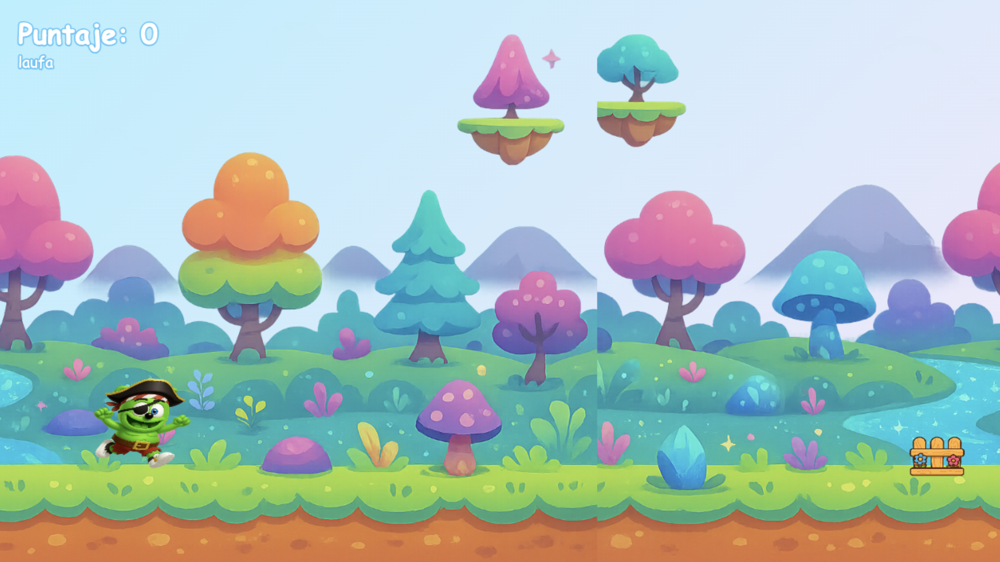
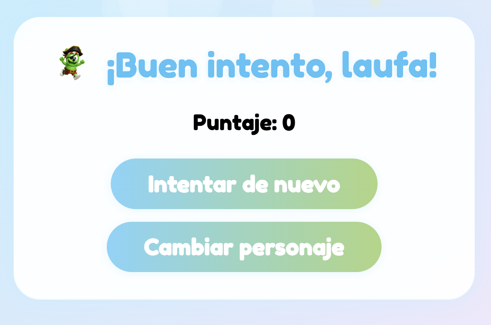

# 🧸 Gummybear Endless Runner 🍬🍭

¡Bienvenido a **Gummybear Endless Runner**!

Un juego 2D endless runner para niños de 5-6 años, protagonizado por Gummybear y sus divertidas variantes. Corre, salta, esquiva obstáculos y recoge golosinas en un mundo mágico y colorido.

---

## 🎮 Descripción General
Gummybear Endless Runner es un juego infantil inspirado en el clásico juego del dinosaurio de Google Chrome, pero con un enfoque visual y de experiencia pensado para los más pequeños. El objetivo es correr sin detenerse, esquivar obstáculos y recolectar golosinas para sumar puntos. El juego termina solo si chocas con un obstáculo, ¡y puedes volver a intentarlo cuantas veces quieras!

---

## ✨ Características Principales
- Personaje principal: Gummybear, con varias skins y disfraces (pirata, astronauta, policía, etc.).
- Fondo animado y colorido, con efecto de loop infinito y cambios de paisaje.
- Obstáculos y golosinas con imágenes y puntajes diferenciados.
- Sistema de puntuación: suma puntos por esquivar obstáculos y recoger golosinas.
- Personalización: ingresa tu nombre y elige tu personaje antes de jugar.
- Interfaz amigable, botones grandes y colores suaves.
- Instrucciones visuales y leyenda de elementos para evitar confusiones.
- Adaptado para niños pequeños: controles simples y feedback visual claro.

---

## 🕹️ Instrucciones de Juego
1. **Pantalla principal:** Haz clic en "¡Empezar!".
2. **Ingresa tu nombre:** Escribe tu nombre para personalizar la experiencia.
3. **Elige tu personaje:** Selecciona tu versión favorita de Gummybear.
4. **Lee las instrucciones:** Observa los controles y la leyenda de obstáculos/golosinas.
5. **¡Juega!**
   - Salta los obstáculos usando la tecla **⬆️ (Flecha Arriba)**.
   - Recoge golosinas para sumar más puntos.
   - El juego termina si chocas con un obstáculo.
   - Puedes reintentar o cambiar de personaje al perder.

---

## 🎮 Controles
- **Salto:** Flecha Arriba (⬆️)
- **Navegación en menús:** Mouse/clic
- **Salir a pantalla principal:** Botón "Salir" en cada pantalla

---

## 🖥️ Requisitos Técnicos
- Navegador web moderno (Chrome, Firefox, Edge, Safari)
- Resolución recomendada: 1280x720px o superior
- No requiere instalación ni conexión a internet tras cargar los recursos

---

## 📁 Estructura de Carpetas
```
gummybear-AMP/
├── assets/              # Imágenes del juego (personajes, fondo, obstáculos, golosinas)
├── docs/                # Documentación de diseño y desarrollo
├── main.js              # Lógica y animación del juego
├── styles.css           # Estilos y diseño visual
├── index.html           # Página principal del juego
├── prompts-imagenes.md  # Prompts para generación de imágenes IA
├── prompts.md           # Historial y análisis de prompts
└── README.md            # Este archivo
```

---

## 📸 Capturas de pantalla

A continuación se muestran ejemplos de las principales pantallas del juego:

| Pantalla                | Imagen de ejemplo                  |
|-------------------------|------------------------------------|
| Pantalla principal      |  |
| Selección de personaje  |  |
| Instrucciones           |  |
| Juego en acción         |  |
| Fin de juego            |  |

---

## 👩‍💻 Créditos
- **Diseño y desarrollo:** Álvaro Maldonado (AI-Powered)
- **Personaje Gummybear:** © Gummybear International
- **Imágenes generadas con IA:** Ver prompts en `prompts-imagenes.md`
- **Inspiración:** Juegos endless runner clásicos y el juego del dinosaurio de Google Chrome

---

¡Gracias por jugar a Gummybear Endless Runner! 